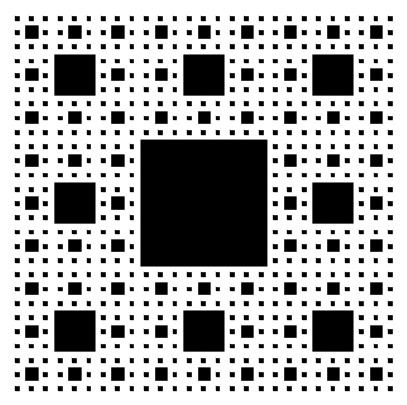
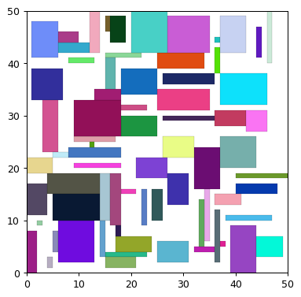
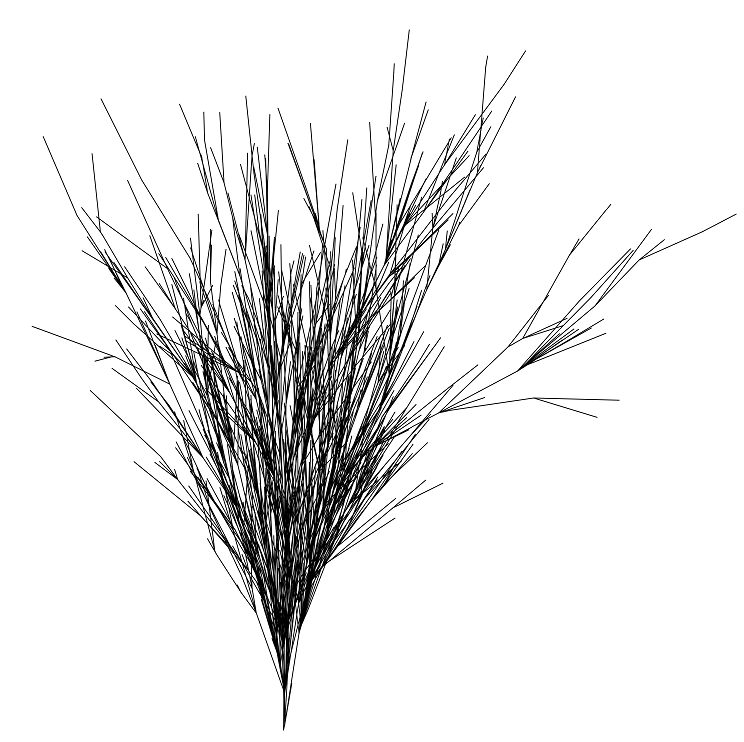
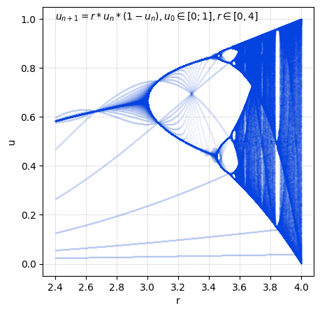

### My sites

* [Engine and multi-agent model](https://jxtopher.github.io/multi-agent-models/)
* [Small study on the spread of disease](https://jxtopher.github.io/experimentations/SASI-model.html)

### My interests

 
 
 
 

### Languages and Tools

