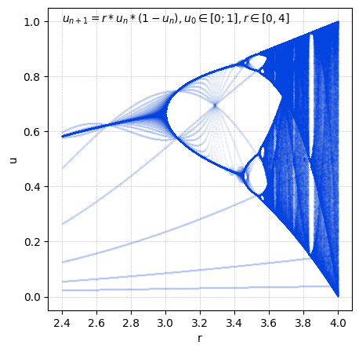

### My sites

* [Engine and multi-agent model](https://jxtopher.github.io/multi-agent-models/)
* [Small study on the spread of disease](https://jxtopher.github.io/experimentations/SASI-model.html)

### My interests

<table>
  <tbody>
    <tr>
      <td align="center" width="100px">
        
         Sierpiński Triangle
      </td>
      <td align="center" width="100px">
        
         Sierpiński Carpet
      </td>
      <td align="center" width="100px">
        
         Bin Packing
      </td>
      <td align="center" width="100px">
        
         L-Systems
      </td>
      <td align="center" width="100px">
        
         Bifurcation Diagram
      </td>
      <td align="center" width="100px">
        
         A* Search
      </td>
    </tr>
  </tbody>
</table>

### 🛠️ Languages and Tools

  
  
  
  
  
  
  
  
  
  
  

